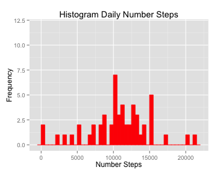
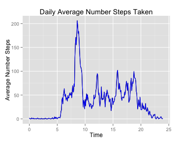
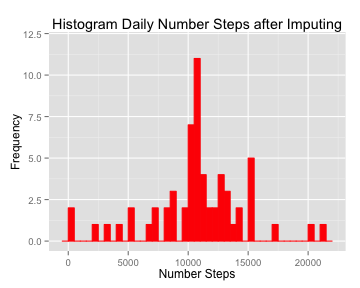
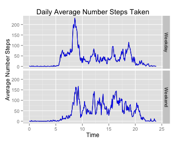

# Reproducible Research: Peer Assessment 1
The data comes from an individual's personal activity monitoring device that collects data at 5 minutes intervals during the day. The data was recorded during October and November 2012 and records the number of steps taken in 5-minute interval each day.

The data is provided as a zip file of a comma separated value file. The variables are steps, date, and interval. 

- steps: Number of steps taking in 5-minute interval

- date: The date of the measurement in YYYY-MM-DD format

- interval: identifier for the 5-minute interval in which measurement taken. The time is recorded in the format h1 where h1 is a multiple of 5 between 0 and 55 or in the format h0h1 where h0 is an integer between 1 and 23 and h1 a multiple of 5 between 0 and 55


```r
library(ggplot2)
library(htmltools)
library(knitr)
library(markdown)
```

## Loading and preprocessing the data
Read the data with the function read.csv() and load it into the data frame data_activity.
Convert the date and interval into a date-time format YYYY-MM-DD h:m The hour is the integer division of the interval and the minutes is the reminder of the integer division. 145 corresponds to 1 hours and 45 minutes. Append to the data frame data_activity 4 columns, one for the hour, for the minutes, for the hour:minute, and the date in the format YYYY-MM-DD H:M


```r
data_activity <- read.csv("activity.csv", sep=",", header=TRUE)
data_activity$hour <- data_activity$interval %/% 100
data_activity$minute <- data_activity$interval - data_activity$hour*100

for (i in 1:dim(data_activity)[1])
{
    if (nchar(as.character(data_activity$hour[i])) == 1)
    {
       data_activity$hour[i] <- paste("0", data_activity$hour[i],sep="")
    }
    
    if (nchar(as.character(data_activity$minute[i])) == 1)
    {
       data_activity$minute[i] <- paste("0", data_activity$minute[i],sep="")
    }
}
data_activity$h_m <- paste(data_activity$hour, data_activity$minute, matrix(data="00", nrow=dim(data_activity)[1], ncol=1), sep=":")
data_activity$date_time <- paste(data_activity$date, data_activity$h_m, sep=" ")
```

## What is mean total number of steps taken per day?

We want to find the number of steps taken each day as well as the mean and median of the number of steps taken. We use the function aggregate to find the activity each day. We also draw the histogram of the number of steps taken each day

```r
total_steps_day <- aggregate(steps ~ date, data=data_activity, FUN=sum)
ggplot(total_steps_day, aes(x=steps)) + geom_histogram(colour = "red", fill = "red", binwidth = 500) + xlab("Number Steps") + ylab("Frequency") + ylim(0,12) + ggtitle("Histogram Daily Number Steps")
```

 


```r
median_steps_day <- median(total_steps_day$steps)
mean_steps_day <- mean(total_steps_day$steps)
```
The median total number of steps taken per day is

```r
median_steps_day
```

```
## [1] 10765
```
The mean total number of steps taken per day is

```r
mean_steps_day
```

```
## [1] 10766
```

## What is the average daily activity pattern?

We plot the time series of the number of steps taken every 5 minutes when the information is available

```r
mean_steps_interval <- aggregate(steps ~ interval, data=data_activity, FUN=mean)
mean_steps_interval$timeplot <- mean_steps_interval$interval %/% 100 + (mean_steps_interval$interval - mean_steps_interval$interval %/% 100 * 100)/60
qplot(timeplot,steps, data=mean_steps_interval, geom = "line") + geom_line(colour = "blue") + xlim(0,24) + ggtitle("Daily Average Number Steps Taken") + xlab("Time") + ylab("Average Number Steps")
```

 

## Imputing missing values

We first find the number of cases for which there is missing data with the complete.cases function. We replace the missing number of steps by the mean values for the time interval

```r
row_num_missing <- data_activity[!complete.cases(data_activity$steps),]
number_data_missing <- dim(row_num_missing)[1]
```
The number of missing values is

```r
number_data_missing
```

```
## [1] 2304
```
Now that we know how many values are missing, we create a new data frame data_activity_imputing and we replace the missing number of steps by the mean values for the time interval. 

```r
data_activity_imputing <- data_activity
for (i in 1:dim(data_activity_imputing)[1])
{
    if (is.na(data_activity_imputing$steps[i]))
    {
        data_activity_imputing$steps[i] <- mean_steps_interval$steps[mean_steps_interval$interval==data_activity_imputing$interval[i]]
    }
}
```


```r
total_imputing_steps_day <- aggregate(steps ~ date, data=data_activity_imputing, FUN=sum)
ggplot(total_imputing_steps_day, aes(x=steps)) + geom_histogram(colour = "red", fill = "red", binwidth = 500) + xlab("Number Steps") + ylab("Frequency") + ylim(0,12) + ggtitle("Histogram Daily Number Steps after Imputing")
```

 


```r
median_imputing_steps_day <- median(total_imputing_steps_day$steps)
mean_imputing_steps_day <- mean(total_imputing_steps_day$steps)
```
The median total number of steps taken per day after imputing with the mean per interval is

```r
median_imputing_steps_day
```

```
## [1] 10766
```
The mean total number of steps taken per day after imputing with the mean per interval is

```r
mean_imputing_steps_day
```

```
## [1] 10766
```
The effect of imputing value with the previously computed mean number of steps for the given interval results results in 8 more days during which people walk between 10 and 11 thousand steps. Because of the way we decided to impute values, the mean and median are the same.

## Are there differences in activity patterns between weekdays and weekends?

Create a new column in the data frame data_activity_imputing in which you track the information whether the day is a weekday or weekend

```r
data_activity_imputing$day_of_week <- weekdays(as.Date(data_activity_imputing$date))
for (i in 1:dim(data_activity_imputing)[1])
{
    if (data_activity_imputing$day_of_week[i] == "Saturday" | data_activity_imputing$day_of_week[i] == "Sunday") {
       data_activity_imputing$type_of_day[i] <- "Weekend" 
    } else {
       data_activity_imputing$type_of_day[i] <- "Weekday" 
    } 
}                                                                                     
```
We plot in different figures the average number of steps taken per day depending on whether it is a weekday or weekend


```r
mean_imputing_steps_interval <- aggregate(steps ~ interval + type_of_day, data=data_activity_imputing, FUN=mean)
mean_imputing_steps_interval$timeplot <- mean_imputing_steps_interval$interval %/% 100 + (mean_imputing_steps_interval$interval - mean_imputing_steps_interval$interval %/% 100 * 100)/60
qplot(timeplot,steps, data=mean_imputing_steps_interval, geom = "line", facets = type_of_day ~ .) + geom_line(colour = "blue") + xlim(0,24) + ggtitle("Daily Average Number Steps Taken") + xlab("Time") + ylab("Average Number Steps")
```

 

